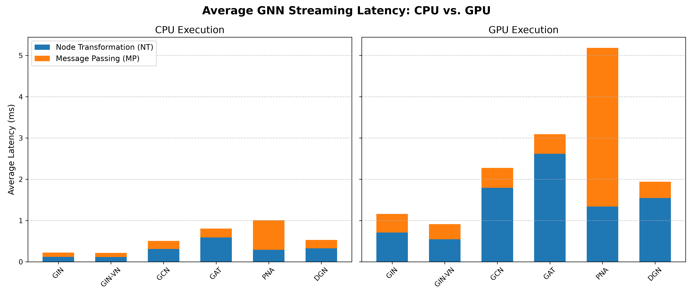

# GNN Hardware Profiling & Bottleneck Analysis: CPU vs. GPU vs. FPGA (FlowGNN)

An empirical systems-level profiling project that benchmarks standard software baselines (CPU & NVIDIA GPU) for Graph Neural Networks (GNNs) under strict real-time streaming constraints (`batch_size = 1`). 

The primary objective of this repository is to measure the execution latency split between **Node Transformation (NT)** and **Message Passing (MP)** phases across diverse GNN architectures, mathematically and empirically motivating the need for specialized FPGA dataflow architectures such as **[FlowGNN](https://github.com/sharc-lab/FlowGNN)**.

---

## Summary & Motivation

In real-time graph inference workloads (e.g., high-energy physics particle tracking, molecular streaming, dynamic fraud detection), graph data arrives sequentially, forcing systems to process graphs with a strict **batch size of 1**. 

Standard modern hardware architectures struggle under this constraint due to fundamental architectural mismatches:
1. **CPU Limitation (Memory Bandwidth Saturation):** While CPUs handle dense linear algebra (MLPs/Node Transformations) reasonably well at small scales, the **Message Passing (MP)** phase relies heavily on scatter/gather operations. This results in irregular, random memory access patterns that destroy cache locality and saturate system memory bandwidth.
2. **GPU Limitation (Kernel Launch Overhead & Underutilization):** While GPUs excel at massively parallel offline training with large batch sizes (e.g., 512+ graphs), streaming single small graphs (such as the ZINC dataset, avg. ~23 nodes / ~50 edges) exposes severe SIMD underutilization. More critically, **CUDA kernel launch overheads (~1.0ms–2.5ms per graph)** dominate the actual silicon compute time, rendering GPUs slower than CPUs for single-graph latency.
3. **The FPGA Solution (FlowGNN):** [FlowGNN](https://arxiv.org/abs/2204.13103) (Sarkar et al., IEEE CICC 2022 / Georgia Tech) introduces a universal, configurable dataflow architecture that utilizes multi-queue streaming to decouple the Node Transformation and Message Passing phases. By pipelining these phases directly in hardware without PCIe I/O bottlenecks or kernel launch overheads, FPGAs achieve orders-of-magnitude improvements in real-time end-to-end latency.

This repository provides the rigorous software baseline profiling that demonstrates *why* FPGAs are essential for real-time GNN workloads.

---

## Key Findings & Results

We profiled 6 representative message-passing GNN architectures using the **ZINC dataset**. We measured **Total Latency**, **NT Latency** (dense MLPs/linear layers), and **MP Latency** (neighborhood aggregation/scatter-gather).

### Bottleneck Ratio ($MP / NT$)
The **Bottleneck Ratio** quantifies the computational burden of memory-bound routing versus FLOP-bound linear transformation:

$$\text{Bottleneck Ratio} = \frac{\text{Message Passing Latency (ms)}}{\text{Node Transformation Latency (ms)}}$$

*(High ratio = memory/routing bound; Low ratio = compute/kernel bound)*

### Hardware Comparison Visualization

### Summary Benchmark Tables (ZINC Dataset - Averaged over 500+ consecutive graphs)

#### CPU Performance Baseline (Intel / Work Environment)
| Model | Avg. Nodes | Avg. Edges | Total Latency (ms) | NT Latency (ms) | MP Latency (ms) | Bottleneck Ratio |
| :--- | :---: | :---: | :---: | :---: | :---: | :---: |
| **GIN** | 23.01 | 49.58 | **0.224 ms** | 0.121 ms | 0.103 ms | **0.860** |
| **GCN** | 23.01 | 49.58 | **0.507 ms** | 0.311 ms | 0.195 ms | **0.628** |
| **DGN** | 23.01 | 49.58 | **0.529 ms** | 0.328 ms | 0.201 ms | **0.615** |
| **GAT** | 23.01 | 49.58 | **0.806 ms** | 0.588 ms | 0.218 ms | **0.369** |

#### NVIDIA GPU Performance Baseline (CUDA / Home Environment)
| Model | Avg. Nodes | Avg. Edges | Total Latency (ms) | NT Latency (ms) | MP Latency (ms) | Bottleneck Ratio |
| :--- | :---: | :---: | :---: | :---: | :---: | :---: |
| **GIN** | 23.01 | 49.58 | **1.160 ms** | 0.708 ms | 0.452 ms | **0.696** |
| **DGN** | 23.01 | 49.58 | **1.939 ms** | 1.547 ms | 0.392 ms | **0.257** |
| **GCN** | 23.01 | 49.58 | **2.275 ms** | 1.793 ms | 0.483 ms | **0.281** |
| **GAT** | 23.01 | 49.58 | **3.094 ms** | 2.616 ms | 0.478 ms | **0.188** |

### Architectural Takeaways
* **The GPU Latency Paradox:** Notice that the NVIDIA GPU is **4x to 5x slower** in total latency than the CPU across all models! Because graph sizes are small, the GPU execution time is entirely dominated by CUDA kernel launch overheads and PCIe host-to-device memory transfers.
* **Amdahl's Law in Action:** As models become more complex (e.g., moving from GIN to GAT with attention mechanisms), the NT phase becomes heavier, lowering the Bottleneck Ratio. However, on standard hardware, you cannot unroll and scale NT parallelism without creating severe routing jams at the memory bus during the MP phase.

---

## Methodology & Technical Notes

* **Phase Instrumentation:** Custom Python timers and PyTorch profiling hooks were wrapped around individual PyTorch Geometric layer invocations. For GPU profiling, `torch.cuda.synchronize()` was strictly enforced before timestamping to prevent asynchronous execution artifacts from distorting kernel timing.
* **Warm-up & Convergence:** In hardware profiling, initial iterations are subject to OS background noise and memory allocation overheads. The profiling scripts execute a warm-up phase and average latencies over 500+ consecutive graphs from the test distribution, ensuring averages converge to stable mathematical baselines out to the 4th decimal place.

---

## References & Acknowledgments
* **FlowGNN Paper:** *Sarkar et al., "FlowGNN: A Dataflow Architecture for Real-Time Workload-Agnostic Graph Neural Network Inference," IEEE Custom Integrated Circuits Conference (CICC), 2022.* [arXiv:2204.13103](https://arxiv.org/abs/2204.13103)
* **Open Source Repository:** [sharc-lab/FlowGNN](https://github.com/sharc-lab/FlowGNN) (Georgia Institute of Technology)
* **Frameworks:** [PyTorch Geometric (PyG)](https://pyg.org/) | [Astral uv](https://docs.astral.sh/uv/)